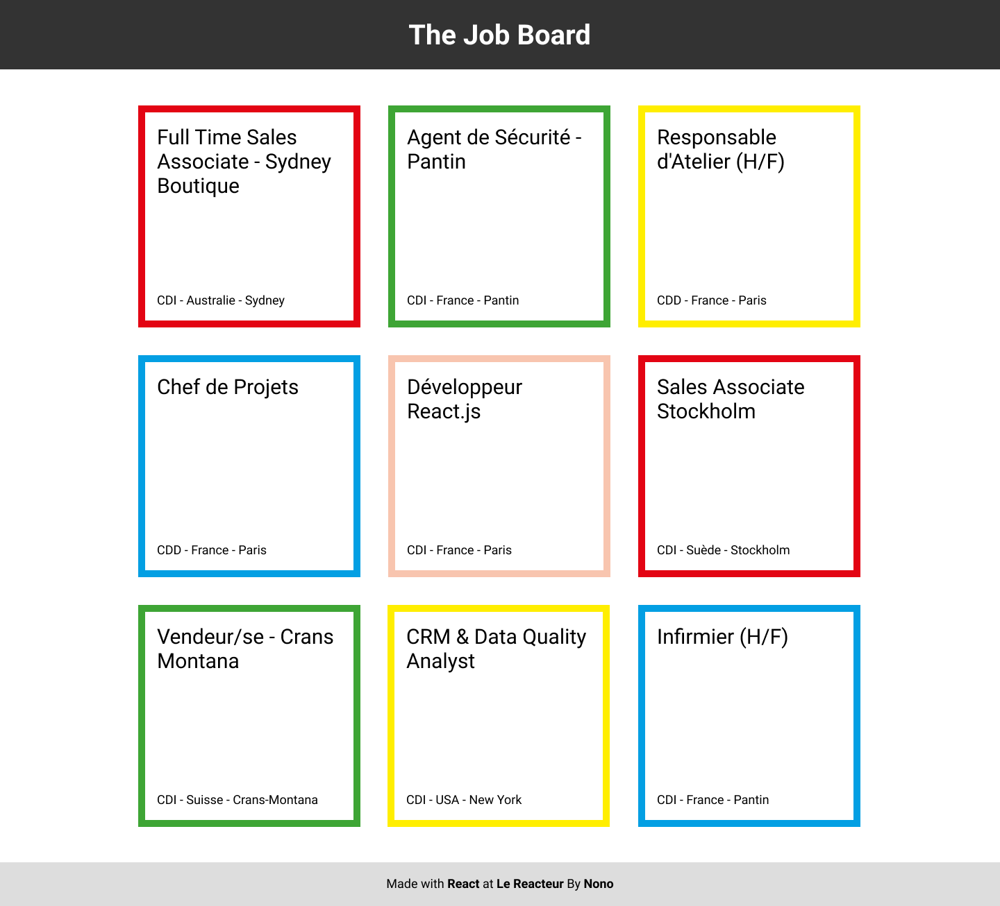

# The Job Board

Site déployé ➡️ **[Job Board](https://antancelin-job-board.netlify.app/)**

Maquette à réaliser :

## Arbre de composants à créer

- App
  - Header
    - Title
  - Jobs
    - Job ayant pour props **'className'**, **'title'**, **'contractType'**, **'country'** et **'city'**
    - Job
    - Job
    - Job
    - Job
    - Job
    - Job
    - Job
    - Job
  - Footer

## Aide

Comment afficher plusieurs lignes d'éléments ?
https://jsfiddle.net/faridsafi/nq3z0yhj

## Bonus

- Déploiement sur Netlify
- Rendre votre projet Responsive
